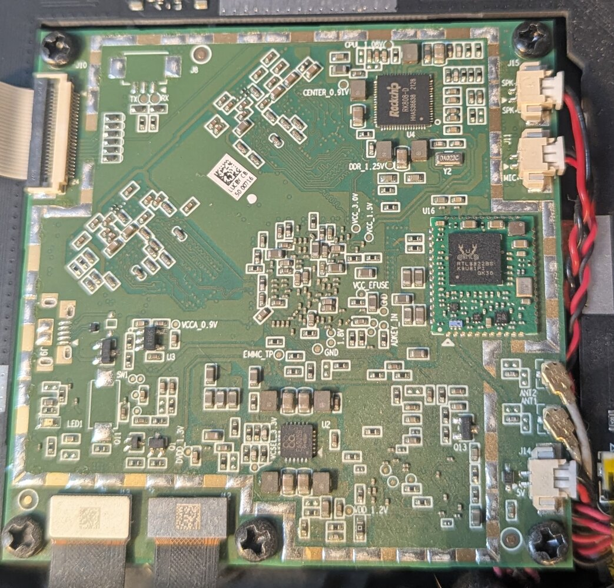

# Trifo Lucy — Local Control & Reverse Engineering

Trifo Robotics went under, leaving Lucy robot vacuum owners with a
cloud-dependent device and no cloud. This project gives Lucy a fully
local brain — no internet, no Trifo servers, no app required.



## What Works

| Feature | Status |
|---------|--------|
| Local control server | Working — replaces Trifo cloud entirely |
| Start / Stop / Pause / Dock | Working |
| Find my robot (voice/beep) | Working |
| Suction power (0-100%) | Working |
| Volume control | Working |
| Real-time status (battery, state) | Working |
| Web UI | Working — dark theme, mobile-friendly |
| Scheduling | Working — via web UI or config file |
| WiFi setup without app | Working — via QR code |
| Root SSH access | Working — see [rooting guide](Getting_root_on_lucy.md) |
| Map decoding | **Unsolved** — [help wanted](collab/) |
| Camera access | **Unsolved** — [help wanted](collab/) |

## Quick Start

### Option A: DNS Redirect (No Root Required)

**You don't need to open your robot.** The server impersonates Trifo's
cloud — Lucy doesn't know the difference. All you need is to redirect two
DNS entries so Lucy connects to your server instead of the dead Trifo servers.

**Requirements:**
- Lucy connected to your WiFi (if she isn't yet, see
  [WiFi Setup Without App](#wifi-setup-without-app) first)
- A PC or server on the same network to run `capture_server.py`
- Ability to change DNS on your router (or run Pi-hole / local DNS)

**Steps:**

1. Add DNS overrides pointing to your server's IP:
   ```
   euiot.trifo.com       → <YOUR_SERVER_IP>
   eudispatch.trifo.com  → <YOUR_SERVER_IP>
   ```
   **How to redirect DNS — pick one:**
   - **Router admin panel** (easiest) — look for "DNS", "Host Override",
     or "Local DNS Records". Most routers support this.
   - **Pi-hole / AdGuard Home** — add the two entries as custom DNS rewrites
   - **Local DNS server** — dnsmasq or similar with the two overrides

2. Run the server: `python capture_server.py`
3. Power-cycle Lucy (or wait — she retries periodically)
4. Open `http://<YOUR_SERVER_IP>:8080` for the web UI
5. Lucy auto-connects and you have full control

### Option B: Rooted Lucy (Full Access)

For advanced users who want SSH access to the robot's Linux system:

1. [Root your Lucy](Getting_root_on_lucy.md) — requires UART + soldering
2. Redirect DNS directly on Lucy:
   ```bash
   echo "<YOUR_PC_IP> euiot.trifo.com" >> /etc/hosts
   echo "<YOUR_PC_IP> eudispatch.trifo.com" >> /etc/hosts
   ```
3. Run the server: `python capture_server.py`
4. Open `http://<YOUR_PC_IP>:8080` for the web UI

Root access enables firmware analysis, map file extraction, and direct
device debugging — but is not needed for day-to-day control.

## Server

The server (`mqtt_capture/capture_server.py`) is a single Python file with
no pip dependencies. It handles:

- **Dispatch protocol** (port 7990) — TLS handshake, device registration
- **MQTT broker** (port 17766) — command/status protocol
- **HTTPS** (port 443) — voice packages, OTA (passthrough)
- **REST API** (port 8080) — JSON API + web UI
- **Control socket** (port 9999) — CLI tool interface

### Web UI

Dark-themed control panel at `http://<server>:8080`:
- Status display (cleaning state, battery, position)
- Control buttons (Start, Pause, Dock, Find)
- Power percentage buttons (0-100% in steps of 10)
- Volume slider
- Mute toggle
- Custom command input for experimentation
- Command reference (collapsible)
- Schedule management (add/remove/toggle entries)

### CLI

```bash
python lucy_control.py start      # start cleaning
python lucy_control.py stop       # stop / pause
python lucy_control.py dock       # return to dock
python lucy_control.py locate     # find me (voice/beep)
python lucy_control.py status     # query status
python lucy_control.py volume 75  # set volume
python lucy_control.py raw 'blowerMode:50'  # raw command
```

### Configuration

Edit `config.yaml`:
- `server.ip` — set to `"auto"` or your server's IP
- `schedule` — add timed cleaning runs
- `regions` — EU/US product keys (pre-configured)

## WiFi Setup Without App

If Lucy isn't on your WiFi yet (new device, factory reset, or never set up
with the now-defunct Trifo app), you can provision her with a QR code:

1. Generate a QR code: `python generate_wifi_qr.py --ssid "YourNetwork" --password "YourPassword"`
2. Hold Lucy's **recharge button** (right button, looking at camera) for **5 seconds**
3. Wait for "entering network configuration" announcement
4. Display QR on your phone at max brightness, start ~1m from camera, slowly approach
5. Lucy announces success and connects to WiFi

See [wifi_provisioning.md](wifi_provisioning.md) for full details, QR format
documentation, and tips for getting the camera to read the code.

## Hardware

| Component | Detail |
|-----------|--------|
| SoC | RK3399 (dual Cortex-A72 + quad Cortex-A53) |
| MCU | STM32F407 (motor/sensor control) |
| OS | Linux 4.4.167, aarch64 |
| WiFi | RTL8822BS |
| Cameras | RGB + ToF depth |
| SLAM | Google Cartographer-based |

## Research & Reverse Engineering

Full RE documentation in the [research docs](collab/docs/):

| Phase | Topic | Status |
|-------|-------|--------|
| 1 | Process architecture | Complete |
| 2 | MQTT message protocol | Complete |
| 3 | ZeroMQ internal services | Complete |
| 4 | MCU serial protocol | Complete |
| 5 | Cloud (QLCloud) protocol | Complete |
| 6 | Proof of concept | Complete |
| 8 | Dispatch protocol | Complete |
| 9 | MQTT commands | Complete — full local control |
| 10 | Local control platform | In progress — server + web UI |
| — | Map/OGM grid decoding | **Unsolved** — [help wanted](collab/) |

## Contributing — Help Crack the Remaining Puzzles

The `collab/` directory is a self-contained research package designed so that
anyone — human or AI — can pick up an open task and contribute. The main
unsolved problems are **map decoding** (OGM grid data uses an unknown encoding)
and **camera access**.

**If you have Claude Code (or any AI coding agent):** you can point it at the
`collab/` folder and it has everything it needs to start working. The tasks
include sample data files, working parser scripts, ground truth reference
images, and detailed research documentation. Just pick a task from
`collab/tasks/` and go.

See [collab/README.md](collab/README.md) for the full contribution framework,
or grab the [reusable template](https://github.com/Gophercs/ai-collab) for
your own projects.

## Images

Hardware photos in `images/`:

| File | Description |
|------|-------------|
| [Lucy1.jpg](images/Lucy1.jpg) | Board overview |
| [Lucy2.jpg](images/Lucy2.jpg) | Board detail |
| [Lucy3.jpg](images/Lucy3.jpg) | Board detail |
| [Lucy4.jpg](images/Lucy4.jpg) | Board detail |
| [Lucy5.jpg](images/Lucy5.jpg) | Board detail |

## Credits

- **Claude** (Anthropic) — research planning, reverse engineering, protocol
  analysis, server architecture, coding, deployment, documentation
- **Chloe** ([@Gophercs](https://github.com/Gophercs)) — pressing buttons,
  noticing things, hardware access, QR code wrangling, making the vacuum play trumpet, dangerously skipping permissions
- **Victor Drijkoningen** — [prior Trifo Max RE work](https://github.com/VictorDrijkoningen/trifo-robotics-rev-eng)
- **Reddit u/ThatsALovelyShirt** - [prior Trifo Max RE work](https://www.reddit.com/r/RobotVacuums/comments/1d1120l/comment/m0m11og)
- **Reddit r/RobotVacuums community**
  

## License

This project is provided as-is for educational and personal use. Use at your
own risk. Not affiliated with Trifo Robotics.
